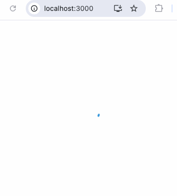

# RotatedProgressSpinner SVG React Sample

This project demonstrates how to create a rotated progress spinner using SVG in a React application.

## Available Scripts

In the project directory, you can run:

### `yarn start`

Runs the app in development mode.\
Open [http://localhost:3000](http://localhost:3000) to view it in your browser.

## Demo



## Project Structure

```plaintext
RotatedProgressSpinner
├── public
│   ├── index.html
│   └── ...
├── src
│   ├── components
│   │   └── RotatedProgressSpinner.js
│   ├── App.js
│   ├── index.js
│   └── ...
├── .gitignore
├── README.md
├── package.json
└── yarn.lock
```
